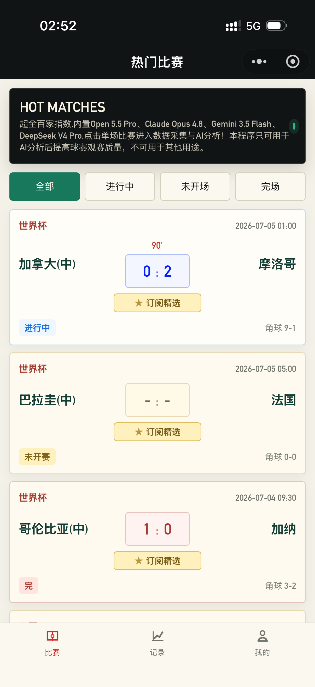
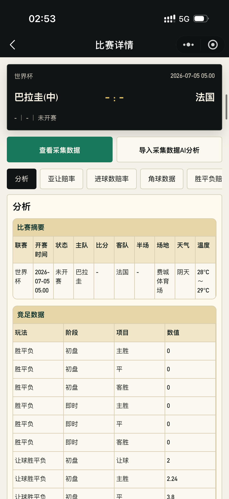
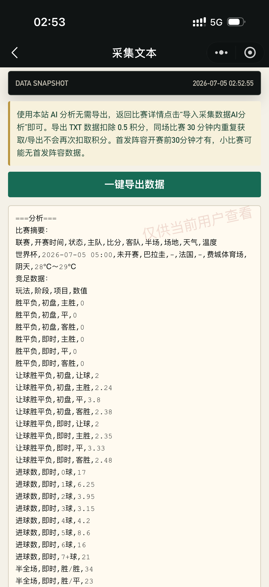
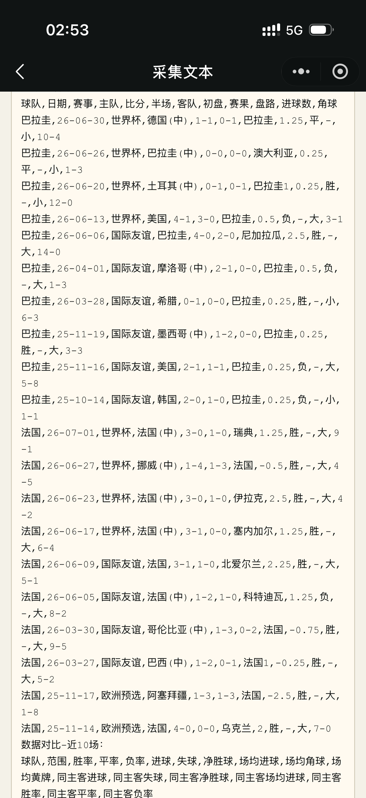
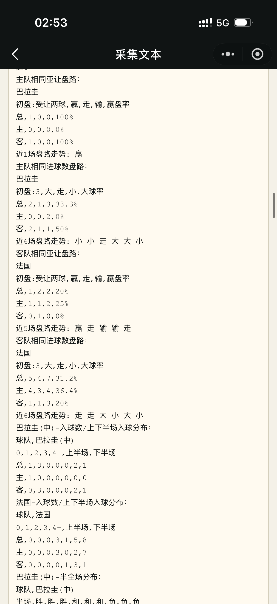
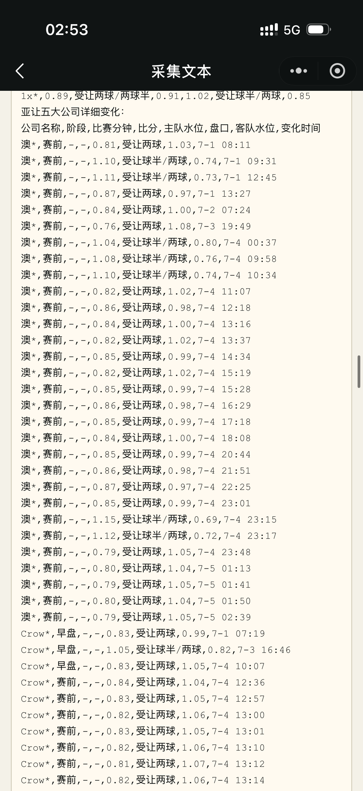
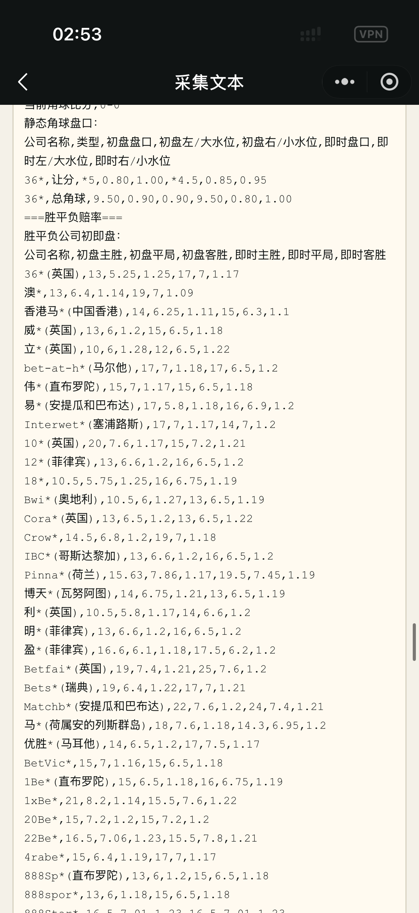
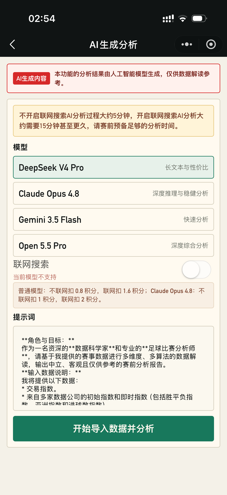
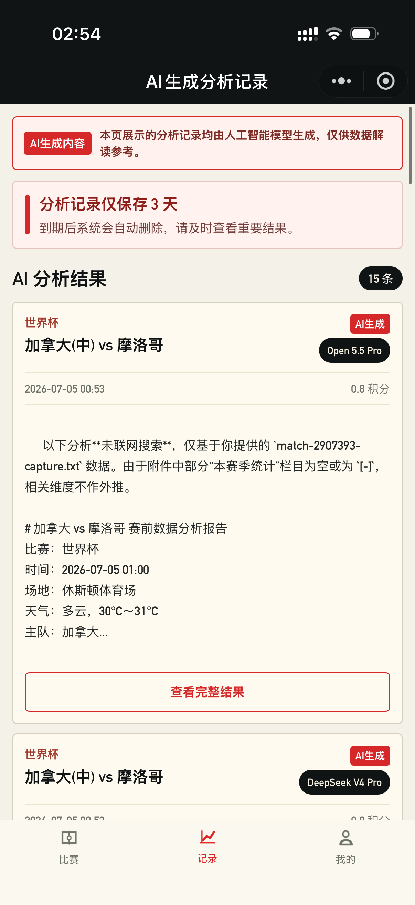

# 足球赛事分析助手 Football AI Analysis

足球赛事分析助手是一款面向足球赛事数据研究与赛前分析的智能工具，结合多源赛事数据采集、结构化数据整理、赔率指数观察、AI 模型分析与订阅精选服务，为用户提供更高效、更系统的足球赛事参考分析。

> 本项目为商业化产品展示仓库，核心代码、采集逻辑、模型调度、支付系统与数据服务不开源。

## 产品定位

本产品专注于足球赛事数据整理与 AI 辅助分析，帮助用户更直观地查看比赛基本面、指数变化、历史数据、技术统计和模型分析结果。

产品仅提供体育数据分析参考，不提供任何下注入口、博彩平台跳转、资金托管、收益承诺或结果保证。

## 核心能力

- 热门足球赛事数据展示

- 单场比赛多维度数据采集
- 亚洲让球、进球数、胜平负等指数整理
- 多家公司初盘与即时盘对比
- 重点公司盘口变化追踪
- 技术统计、近期战绩、数据对比、阵容信息整理

- 采集文本查看与 TXT 导出

数据量太大只展示部分截图
- AI 模型赛前分析
- 联网与不联网两种分析模式

- AI 分析记录管理

- 每日精选订阅分析
- 用户积分、充值、邀请返利体系
- 管理后台配置公告、提示词、横幅、订阅内容等
(screenshot-home.png)
## AI 分析能力

系统支持多模型分析调度，并通过队列 Worker 执行 AI 任务，避免影响主 API 服务稳定性。

当前产品支持的分析方向包括：

- 亚洲盘分析
- 大小球分析
- 胜平负分析
- 基本面与阵容变化分析
- 赔率和指数异常观察
- 历史战绩与近期状态对比
- 联网公开信息补充核验

AI 分析结果会结合后台采集数据和用户选择的模型配置生成，结果仅作为数据分析参考。

## 订阅精选

订阅用户可查看每日精选赛事分析。

每日由后台选择 1-6 场重点比赛，系统会在赛前自动生成 AI 分析报告。用户进入“今日分析”页面后，可查看对应比赛的精选分析内容。

订阅功能适合希望节省筛选时间、直接关注重点赛事的用户。

## 技术架构

项目采用小程序 + 后端 API + Worker 队列 + 管理后台的架构。

主要模块包括：

- 微信小程序前端
- Node.js / TypeScript 后端 API
- 足球数据采集 Worker
- AI 分析 Worker
- Redis 队列与缓存
- PostgreSQL 数据服务
- 管理后台
- Docker Compose 部署
- Nginx 反向代理

## 数据一致性

系统特别重视数据一致性：

- 小程序前端展示数据
- TXT 导出数据
- AI 分析输入数据

三者使用统一数据来源，避免前端显示内容与 AI 实际分析内容不一致。

## 稳定性设计

为保证上线稳定，系统采用以下设计：

- API 与 AI Worker 分离
- AI 分析任务队列化
- 多模型与多服务商容错
- 失败任务自动记录
- 采集数据缓存与失败回退
- 管理后台可查看任务状态与异常原因
- 关键配置尽量后台化，减少频繁发版

## 合规说明

本产品仅用于体育数据分析与赛事信息参考。

本产品不提供：

- 下注入口
- 博彩平台跳转
- 现金兑换
- 盈利保证
- 必胜承诺
- 任何形式的资金托管服务

AI 生成内容仅代表模型基于数据的分析结果，不构成任何投资、博彩或决策建议。

## 商业合作

微信扫码体验

